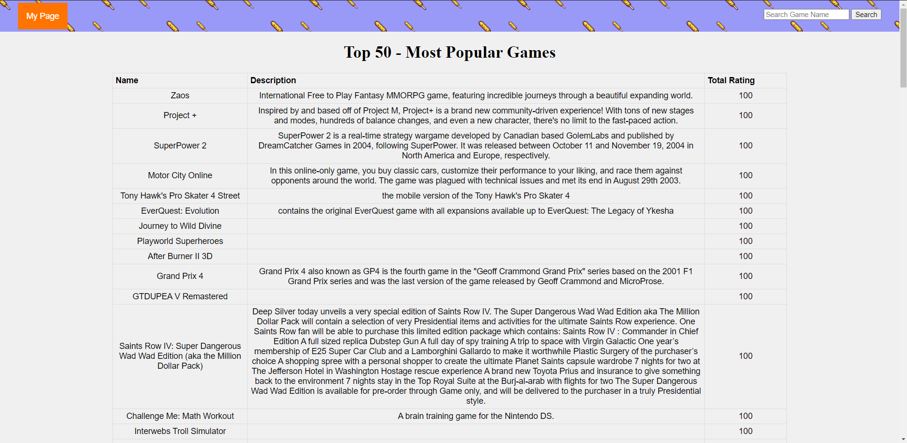
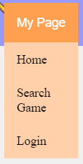
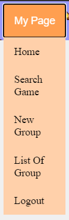
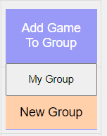
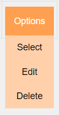
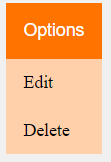

<br />
<p align="center">
  <a href="https://github.com/MastetsaM/PI-2021i-LEIRT51D-G03">
    
  </a>

  <h3 align="center">Trabalho de PI 2020/21</h3>


<details open="open">
<summary>Table of Contents</summary>
		<ol>
				<li>
						<a href="#wiki-trabalho-1">Trabalho 1</a>
						<ul>
								<li><a href="#servidor">Servidor</a></li>
								<li><a href="#web-api">Web API</a></li> 
								<li><a href="#testes-trab1">Testes-Trab1</a></li> 
						</ul>
				</li>
				<li>
						<a href="#wiki-trabalho-2">Trabalho 2</a>
						<ul>
								<li><a href="#requisitos-funcionais">Requisitos funcionais</a></li>
								<li><a href="#requisitos-não-funcionais">Requisitos não funcionais</a></li>
								<li><a href="#instalação-2">Instalação 2</a></li>
								<li><a href="#como-usar-api">Como Usar API</a></li>
								<li><a href="#testes-trab-2">Testes-Trab 2</a></li> 
						</ul>
				</li>
				<li>
						<a href="#wiki-trabalho-3">Trabalho 3</a>
						<ul>
								<li><a href="#requisitos">Requisitos</a></li>
								<li><a href="#instalação-3">Instalação 3</a></li>
								<li><a href="#preparar-e-iniciar-servidor-3">Preparar e Iniciar servidor</a></li>
								<li><a href="#como-usar-api">Como Usar API</a></li>
								<li><a href="#como-usar-ui">Como Usar UI</a></li>
								<li><a href="#testes-trab-3">Testes-Trab 3</a></li> 
						</ul>
				</li>
		</ol>
</details>


# Wiki-Trabalho 1

Neste trabalho foi pedido para criarmos um servidor que tenha como funcionalidade pesquisar por determinados jogos e armazena-los num conjunto de grupos. A pesquisa dos jogos é realizada através da [web API](https://api-docs.igdb.com/#examples), disponibilizada pelo site [IGDB](https://igdb.com/). O tratamento dos grupos tambem é realizado, sendo que o utilizador possui a capacidade de criar, editar ou visualizar os grupos.

## Servidor
O servidor é constituido por 5 módulos, apresentando dependências entre si:
-   `covida-server.js`  - Ficheiro que constitui o ponto de entrada na aplicação servidora.
-   `covida-web-api.js`  - Implementação dos rotas HTTP que constituem a API REST da aplicação Web.
-   `covida-services.js`  - Implementação da lógica de cada uma das funcionalidades da aplicação.
-   `igdb-data.js`  - Acesso à API IGDB.
-   `covida-db.js`  - Acesso ao à base de dados.

As dependência entre estes módulos é a seguinte:

	covida-server.js -> covida-web-api.js -> covida-services.js -> igdb-data.js
	                                                            -> covida-db.js
	                                                            
**igdb-data.js** - O módulo igdb-data é responsavel por:												
 -   Obter a lista dos jogos mais populares.
 -   Pesquisar jogos pelo nome.

**covida-db.js** - O módulo covida-db gerir grupos de jogos favoritos:
-   Criar grupo atribuindo-lhe um nome e descrição
-  Editar grupo, alterando o seu nome e descrição
- Listar todos os grupos
- Obter os detalhes de um grupo, com o seu nome, descrição e nomes dos jogos que o constituem.
- Adicionar um jogo a um grupo
- Remover um jogo de um grupo
- Obter os jogos de um grupo que têm uma votação média (total_rating) entre dois valores (mínimo e máximo) entre 0 e 100, sendo estes valores parametrizáveis no pedido. Os jogos vêm ordenadas por ordem decrescente da votação média.


## Web API
A funcionalidade da **covida-web-api.js** é tratar os pedidos recebidos, decidindo o tipo de pedido HTTP e a funcionalidade. Este tratamento depende do URL utilizado na realização dos pedidos.

- igdb-data
	- `/game/popular` - Retorna os 50 jogos mais populares.
				`[ { "id": 141408, "name": "Zaos", "rating": 100, "total_rating": 100 }, ...]`
				
	- `/game/:game` - No caso de existir irá retornar o jogo pretendido. Necessita receber o nome de um jogo.
    `{"id":131887,"name":"Project +","total_rating":100}`

- covida-db
	- `/group/newGroup` - Utilizado para criar novos grupos. Recebe um grupo novo, com nome e descrição.
	`{"id":0,"name":"faforitos","description":"esta é a versão errada","games":null}`
	
	- `/group/edit/:groupId` - Utilizado para criar editar grupos. Recebe o novo nome e descrição.
	`{"id":0,"name":"favoritos","description":"versao editada","games":null}`
	
	- `/group/list` - Utilizado para conseguir visualizar todos os grupos existentes.
	`[{"id":0,"name":"favoritos","description":"versao editada","games":null}]`
	
	- `/group/info/:groupId` - Utilizado para visualizar um determinado grupo, com base no seu id. 
	`{"id":0,"name":"favoritos","description":"versao editada","games":null}`
	
	- `/group/addGame/:groupId/game/:game` - Utilizado para adicionar novos jogos, recebendo o nome de um jogo.
	`{"id":26472,"name":"Disco Elysium","total_rating":92.56569534922265}`
	
	- `/group/removeGame/:groupId/game/:game` - Utilizado para remover jogos de um grupo, recebendo o nome do jogo.
	`[{"id":26472,"name":"Disco Elysium","total_rating":92.56569534922265},
	{"id":1105,"name":"Metroid Prime","total_rating":93.63190778180625}]`
	
	- `/group/getGameByRating` -  Utilizado para obter jogos de um dado grupo, cujo rating esteja no intervalo indicado.
	`[{"id":1105,"name":"Metroid Prime","total_rating":93.63190778180625},
	{"id":26472,"name":"Disco Elysium","total_rating":92.56569534922265}]`
		- `/:groupId` - Retorna jogos com rating entre 0 e 100.
		- `/:groupId/min/:minRating` - Retorna  jogos com rating entre minRating e 100.
		- `/:groupId/max/:maxRating` - Retorna  jogos com rating entre 0 e maxRating.
		- `/:groupId/min/:minRating/max/:maxRating` - Retorna jogos com rating entre minRating e maxRating. 
		

## Testes-Trab1
Para verificar as funcionalidades de cada modulo foram criados diversos testes.

Para validar as funcionalidades da **web-api** utilizou-se o postman em conjunção com o modulo **covida-server-mocha**
De modo a ter resultatos esperados nos testes presentes no postman é necessario o uso do modulo **covida-server-mocha**

Para a validação dos restantes modulos utilizou-se testes **mocha**, isto é, os testes unitarios presentes na pasta test 


# Wiki-Trabalho 2

O objetivo principal desta parte é refazer o código implementado (_refactor_) de modo a incorporar as tecnologias e técnicas entretanto abordadas em PI, nomeadamente o suporte para _Promises_ e as construções `async`/`await` da linguagem JavaScript e armazenar os dados geridos pela aplicação na base de dados ElasticSearch.
## Requisitos funcionais

1.  A funcionalidade de remover groupos foi adicionada nos modulos **covida-db-js** e **elastisearch.js** atravez da função ***removeGame*** que remove o groupo pretendido de acordo com o Id passado.
	    
2.  De modo a ser possivel ter diversos groupos com o mesmo nove introduzimos o **ID**. Deste modo podemos ter varios groupos com o mesmo nome, pois todos os groupos têm um ID unico.


## Requisitos não funcionais

1.  A implementação dos módulos  `covida-db`,  `igdb-data`,  `covida-service`  e  `covida-web-api` sofreu alteraçoes relativamente ao primeiro Trabalho, substituindo a utilização de  _callbacks_  por um idioma assíncrono baseado em  `Promise`  e/ou em  `async/await`. Os respetivos  _mocks_  e testes unitários devem ser adaptados em conformidade com a nova API. Garanta que o correto funcionamento de todos os módulos é validado por testes unitários. Ainda que o modulo `covida-db.js` não seja utilizado durante execução do programa, este foi elterrado de acordo com o proposto neste ponto.
    
3.  Alterar a utilização do módulo  `urllib`  passando a utilizar o seu suporte para promises, ou substituir a sua utilização pelo o módulo  [`node-fetch`](https://www.npmjs.com/package/node-fetch)  para realizar pedidos http.
    
4.  Criar um novo módulo que substitui o  `covida-db`  de modo a que os dados sejam armazenados numa base de dados ElasticSearch. Esta alteração não deve implicar qualquer alteração adicional nos restantes módulos da aplicação. A interação com o ElasticSearch deve ser feita através da sua API HTTP e, como tal, nenhum módulo específico para esta base de dados pode ser usado. Ao realizar esta alteraçao obtemos as seguintes dependência entre módulos:
   ```sh
   covida-server.js-> covida-web-api.js-> covida-services.js-> igdb-data.js
   							 -> elasticsearch.js
   ``` 
   
## Instalação 2

1. Clonar o Repositorio
   ```sh
   git clone https://github.com/MastetsaM/PI-2021i-LEIRT51D-G03.git
   ```
2. Entrar na pasta referente ao trabalho 2 e Instalar os pacotes NPM 
   ```sh
   npm install
   ```
3. [Download Elasticsearch](https://www.elastic.co/downloads/elasticsearch)

## Como Usar 2
**# Pré-requisitos -** De modo a executar o programa com sucesso é necessario realizar a <a href="#instalação">instalação</a>
1. Abrir a pasta do Trabalho 2
2. Abrir o terminal(Prompt de Comando)
3. Iniciar o servidor
   ```sh
   node .\covida-server.js
   ```
4. Abrir a pasta Elasticsearch adquirida no ponto 3 da instalação e iniciar a Base de dados
   ```sh
   Run `bin/elasticsearch` (or `bin\elasticsearch.bat` on Windows)
   or
   Run `curl http://localhost:9200/` or `Invoke-RestMethod http://localhost:9200` with PowerShell
   ```
5. Esta pronto a usar. Basta utilizar os links abaixo para organizar os seus grupos

||**IGDB Options**|Method||
|-|-------|-------|-------|
||Popular Games|GET|http://localhost:8888/Game/Popular|
||Get Game|GET|http://localhost:8888/Game/:game|
||**Group Options**||
||Create New Group|POST|http://localhost:8888/group/newGroup|
||Edit Group|PUT|http://localhost:8888/group/:groupId|
||List Of Groups|GET|http://localhost:8888/group/list|
||Get Group|GET|http://localhost:8888/group/:groupId|
||Add Game|PUT|http://localhost:8888/group/:groupId|
||Remove Game|DELETE|http://localhost:8888/group/:groupId/:game|
||Remove Group|DELETE|http://localhost:8888/group/:groupId|
||Games By Rate|
||Minimum|GET|http://localhost:8888/group/:groupId/min/:minRating|
||Maximum|GET|http://localhost:8888/group/:groupId/max/:maxRating|
||Min and Max|GET|http://localhost:8888/group/:groupId/:minRating/:maxRating|

### Body:
As opções **Create New Group** e  **Edit Group** necessitam de um body com a seguinte estrutura
   ```sh
   {
	"name": "GROUP NAME",
	"desc": "GROUP DESCRIPTION"
}
   ```

### Deve substituir os seguintes elementos:
   ```sh
   :game		-> Nome do jogo a pesquisar
   :groupId	-> Id do grupo a interagir
   :minRating	-> Valor minimo do total_rating dos jogos a apresentar 
   :maxRating	-> Valor maximo do total_rating dos jogos a apresentar
   ```

## Testes-Trab2
Para este trabalho foram realizados 2 tipos de testes. Testes para o servidor como um todo e testes para os modulos `covida-db`,  `igdb-data`,  `covida-service`, idividualmente. Ambos os testes têm que ser realizados na pasta do segundo trabalho.

Os teste para o servidor foram realizadas através da biblioteca ***frisby***, pelo que para correr os mesmos é necessario o uso do seguinte codigo, no Prompt de Comando: **npx jest**. Um outro modo para testar o sergidor é através dos testes do **postman**. No entanto para que os testes do postman possam funcionar é necesssario correr todos em simultaneo. Para correr os testes individualmente é necessario garantir as condiçoes necessarias para cada teste (Exemplo: ter groupo criado para testar a funcionalidade de editar grupos). Para correr os testes, tanto com o postman, como com o frisby, é necessario que o servidor e o elasticsearch estejam iniciados.
<p align="center">
  <a href="https://github.com/MastetsaM/PI-2021i-LEIRT51D-G03">
    
    
  </a>
	<p />
	
Para os testes unitarios utilizou-se a biblioteca ***chai***, sendo por isso necessario o uso do codigo **npm test**.


# Wiki-Trabalho 3

O objetivo desta ultima parte é implementar uma interface Web para apresentar num Browser e acrescentar suporte para uatentificação. Deste modo qualquer utilizador pode facilmente navegar entre as diversas opções e possa ter dados privados.

## Requisitos

1.  De modo a ter uma interface Web para apresentar num web browser foi necessario elaborado um novo modulo, que tem como principal funcionalidade o tratamento dos pedido da interfaçe do utilizador, chamado  `covida-web-ui`. Este modulo tem como principal funcionalidade apresentar uma dada pagina de acordo com o pedido do utilizador. Este modulo apresenta um afuncionanento identico ao modulo `covida-web-api`, no entato o resultado opbtido pelo utilizador é uma pagina HTML e na outra é uma resposta JSON, respetivamente. O modulo `covida-web-ui` em conjunção com o modulo Handlebars ajuda na criação da pagina HTML e CSS ajuda na apresentação da pagina, isto é, "embelezar" a pagina HTML.

2. A implementação do modulo `covida-web-ui` em conjunção com o modulo Handlebars foram utilizados de modo a que o utilizador não tenha que lidar com identificadores (ID's), sendo apenas necessario inserir dados quando o utilizador procura jogos ou cria groupos.

3.  Para permitir que cada utilizador posso ter os seu dados privados utilizamos o módulo `Passport`, que permiter utilizar cookies e um sistema de login, deste modo cada grupo está acossiado a um dado utilizador. O modulo `Passport` é um midleware cuja unica funcionalidade é tratar da autenticação dos utilizadores. Após a implementação do módulo `Passport`, o modulo `covida-web-ui` sofreu alterações de modo a só demonstrar os grupos que correspondam ao utilizador actual. Com isto tambem foi necessario impedir que pessoas que não sejam utilizadores da aplicação possam criar a alterar dados, como por exemplo criar grupos.
    
4.  Com esta parte do trabalho deve ser entregue um relatório no wiki do repositório do grupo, com a descrição da implementação do trabalho realizado na sua totalidade. Deste modo, não devem constar os estados intermédios pelo qual a implementação passou em cada uma das fases. No relatório deve constar obrigatoriamente:
    
    -   Descrição da estrutura da aplicação, em ambas as componentes (servidora e cliente).
    -   Documentação da API do servidor.
    -   Instruções de  **todos**  os passos prévios que é necessário realizar para correr aplicação e os respetivos testes.
        -   Nesses passos devem estar incluídos as ações necessárias para introdução automática de dados de teste, por forma a que seja possível correr a aplicação com dados.
        -   As instruções devem ter toda a informação necessária para correr a aplicação em qualquer máquina, nomeadamente na do docente. Caso essas instruções não sejam suficientes para colocar a aplicação a correr no máximo em 5 min, a nota máxima da componente prática fica limitada a 12 valores.
        
5. Com as alterações anteriores obtemos as seguintes dependência entre módulos:
   ```sh
   covida-server.js-> covida-web-api.js-> covida-services.js-> igdb-data.js
   							 -> elasticsearch.js
   ``` 
   
## Instalação 3

1. Clonar o Repositorio
   ```sh
   git clone https://github.com/MastetsaM/PI-2021i-LEIRT51D-G03.git
   ```
2. Entrar na pasta referente ao trabalho 2 e Instalar os pacotes NPM 
   ```sh
   npm install
   ```
3. [Download Elasticsearch](https://www.elastic.co/downloads/elasticsearch)

## Preparar e Iniciar servidor 3
**# Pré-requisitos -** De modo a executar o programa com sucesso é necessario realizar a <a href="#instalação-3">instalação</a>

1. Abrir a pasta Elasticsearch adquirida no ponto 3 da instalação e iniciar a Base de dados 
   ```sh
   Run `bin/elasticsearch` (or `bin\elasticsearch.bat` on Windows)
   or
   Run `curl http://localhost:9200/` or `Invoke-RestMethod http://localhost:9200` with PowerShell
   ```
2. Abrir a pasta **PI-2021i-LEIRT51D-G03** obtidano ponto 1 da <a href="#instalação-3">instalação</a>
3. Abrir a pasta do Trabalho 3
4. Abrir o terminal(Prompt de Comando), na pasta  **PI-2021i-LEIRT51D-G03\Trabalho 3** .
5. Iniciar o servidor
   ```sh
   node .\covida-server.js
   ```
6. Esta pronto a usar. Basta segir os passo em  **<a href="#como-usar-api">Como Usar API</a>** ou   **<a href="#como-usar-ui">Como Usar UI</a>** 

## Como Usar API
De nodo a utilizar a api criada é necessario realizar um dos pedidos abaixo, utilizando o metodo indicado. Todas as opções da ***API*** podem ser encontradas na ***UI***. Algumas das funcionalidade requerem um body, cuja estrutura está presente abaixo. 
||**Options**|Method||
|-|-------|-------|-------|
||**User Options**|
||Singup|POST|http://localhost:8888/api/signup|
||Login|POST|http://localhost:8888/api/login|
||Logout|POST|http://localhost:8888/api/logout|
||**IGDB Options**|
||Popular Games|GET|http://localhost:8888/api/Game/Popular|
||Get Game|GET|http://localhost:8888/api/Game/:game|
||**Group Options**||
||Create New Group|POST|http://localhost:8888/api/group/newGroup|
||Edit Group|PUT|http://localhost:8888/api/group/:groupId|
||List Of Groups|GET|http://localhost:8888/api/group/list|
||Get Group|GET|http://localhost:8888/api/group/:groupId|
||Add Game|PUT|http://localhost:8888/api/group/:groupId|
||Remove Game|DELETE|http://localhost:8888/api/group/:groupId/:game|
||Remove Group|DELETE|http://localhost:8888/api/group/:groupId|
||Games By Rate|
||Minimum|GET|http://localhost:8888/api/group/:groupId/min/:minRating|
||Maximum|GET|http://localhost:8888/api/group/:groupId/max/:maxRating|
||Min and Max|GET|http://localhost:8888/api/group/:groupId/:minRating/:maxRating|

### Body:
As opções **Create New Group** e  **Edit Group** necessitam de um body com a seguinte estrutura
   ```sh
   {
	"name": "GROUP NAME",
	"desc": "GROUP DESCRIPTION"
}
   ```
Para as opções de **Signup** e ** Login** necessitam de um body com a seguinte estrutura
   ```sh
   {
	"username": "USERNAME",
	"password": "PASSWORD"
}
   ```

### Deve substituir os seguintes elementos:
   ```sh
   :game		-> Nome do jogo a pesquisar
   :groupId	-> Id do grupo a interagir
   :minRating	-> Valor minimo do total_rating dos jogos a apresentar 
   :maxRating	-> Valor maximo do total_rating dos jogos a apresentar
   ``` 

## Como Usar UI

Para utilizar Interface Web basta usar o **URL:** http://localhost:8888/.
<p align="center">
	<a href="https://github.com/MastetsaM/PI-2021i-LEIRT51D-G03">
		
	</a>
<p />

A partir desta pagina web é possivel utilizar o menu que está presente no canto superior esquerdo onde, que dependendo do estado do utilizador irá apresentar os seguintes menus (esquerda sem Login e direita com Login):
<p align="center">
	<a href="https://github.com/MastetsaM/PI-2021i-LEIRT51D-G03">
		
		
	</a>
<p />

Ao utilizar o menu é possivel aceder às paginas onde è possivel realizar todas as ações presentes no `covida-web-api` através a Interface do utilizador.  É tambem possivel pesquisar por um dado jogo a qualquer momento, atraves do formulario no canto superior direito da pagina.
<p align="center">
	<a href="https://github.com/MastetsaM/PI-2021i-LEIRT51D-G03">
		
	</a>
<p />

Em cada pagina existem diversos menus. Na pagina ***Home*** e na pagina ***Search Game*** existe um menu que permite adicionar o jogo pretendido a um grupo ou criar um grupo caso ainda nao exista.
<p align="center">
	<a href="https://github.com/MastetsaM/PI-2021i-LEIRT51D-G03">
		
	</a>
<p />

No caso de o utilizador querer criar um grupo existe a pagina ***Create Group*** que tem como unica funncionalidade criar um grupo de acordo com a informação inserida pelo utilizador, mais especificamente Nome e Descrição.

Na pagina ***List of Groups*** , que irá apresentar os grupos do utilizador, para cada grupo esta um menu com as ações aplicaveis ao grupo. Selecionar a opção **`Select`** redireciona o utilizador para uma pagina que nao aparece no menu, que apresenta o grupo escolhido. A opção  **`Edit`** permite ao utilizador mudar o nome e descrição do grupo em questão. A opção **`Delete`** ira apagar o grupo (não é revertivel). 
<p align="center">
	<a href="https://github.com/MastetsaM/PI-2021i-LEIRT51D-G03">
		
	</a>
<p />

Na pagina ***List of Groups*** (imagem da esquerda) , que irá apresentar os grupos do utilizador, para cada grupo esta um menu com as ações aplicaveis ao grupo. Um menu similar é apresentado na pagina ***Specific Group*** (imagem da direita)
<p align="center">
	<a href="https://github.com/MastetsaM/PI-2021i-LEIRT51D-G03">
		
		
	</a>
<p />


## Testes-Trab 3
Para este trabalho foram realizados 2 tipos de testes. Testes para o servidor como um todo e testes para os modulos `covida-db`,  `igdb-data`, idividualmente. Ambos os testes têm que ser realizados na pasta do Terceiro trabalho. 

De modo a realizar os testes, é necessario **<a href="#preparar-e-iniciar-servidor-3">Preparar e Iniciar servidor</a>**. Após este passo basta abrir  um novo terminal(Prompt de Comando), na pasta  **PI-2021i-LEIRT51D-G03\Trabalho 3** e correr um dos seguintes:
   ```sh
   npx jest (para os testes em  PI-2021i-LEIRT51D-G03\Trabalho 3\_tests_)
   
	 and / or
   
   npm test (para os testes em  PI-2021i-LEIRT51D-G03\Trabalho 3\tests)
   ```
